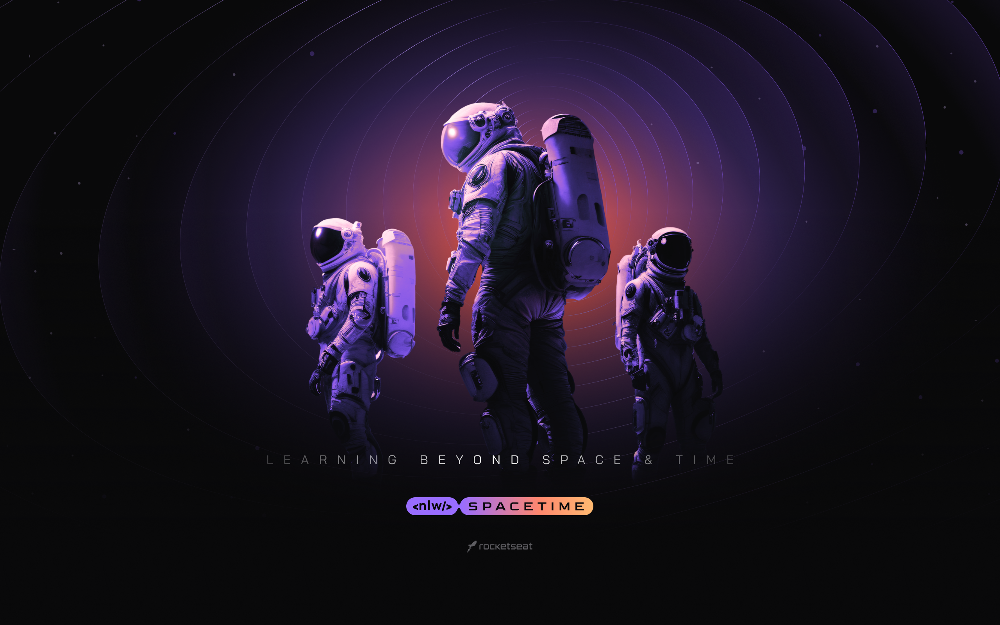

<h1 align="center">
    
</h1>
<h1 align="center">Next Level Week - Spacetime</h1>
<p align="center">Project <strong>Spacetime</strong> developed during the Rocketseat Next Level Week Spacetime.
    Spacetime is a project to post memories from your time capsule and share them.
</p>

<p align="center"> 
  </img>
</p>

## Instalation
To install the dependencies and to execute the **Backend**, clone the project on your computer an execute:
```bash
# Enter on backend directory
$ cd server

# Install dependencies
$ yarn

# Run Migrates
$ npx prisma migrate dev

# Start server
$ yarn run dev

# running on port 3333
```

## Backend

</img>

## Frontend

To run the React's Frontend use:
```bash
# Enter on frontend directory
$ cd web

# Install dependencies
$ yarn

# Run
$ yarn run dev
```
</img>

## Mobile

To run the Mobile app, use:
```bash
# Enter on mobile directory
$ cd mobile

# Install dependencies
$ yarn

# Run
$ yarn start

# Expo will open, just scan the qrcode on terminal or expo page
```
</img>

## Licence

[MIT](./LICENSE) &copy; [Rocketseat](https://rocketseat.com.br/)

Made with ♥ by Diego Andrade :wave: [Get in touch!](https://www.linkedin.com/in/diego-rodrigo-de-andrade-98a0271a0/)

